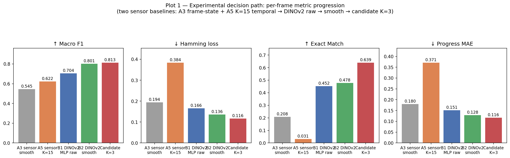
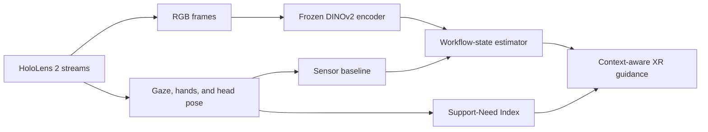
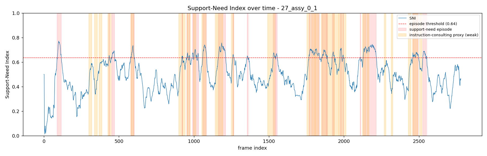

# Multimodal AI and XR for Human-Centric Manufacturing

An experimental perception pipeline for context-aware XR assistance during manual
assembly. The project uses egocentric RGB, gaze, hand tracking, and head-pose data
from a Microsoft HoloLens 2 to answer two questions in real time:

1. **Where is the operator in the assembly workflow?**
2. **When might the operator benefit from additional guidance?**

The two components are designed as complementary inputs to an XR guidance system:
workflow state selects the relevant instruction, while the Support-Need Index helps
decide when to show it.



## Project Components

| Component | Inputs | Method | Output |
| --- | --- | --- | --- |
| [Workflow-state estimation](workflow-state-estimation/) | RGB, gaze, hands, head pose | Sensor Random Forest baseline and frozen DINOv2 embeddings with an MLP head and temporal constraints | Cumulative 9-step assembly state and progress |
| [Support-Need Index](support-need-index/) | Gaze and hand tracking | Gaze entropy, hand-motion stall, and instruction-area dwell fused over a rolling window | Continuous support score and detected support episodes |



## Key Results

The recorded experiments use four assembly recordings for training and one held-out
recording for evaluation.

| Experiment | Result |
| --- | ---: |
| DINOv2 + MLP + sustained commitment: macro F1 | **0.813** |
| DINOv2 + MLP + sustained commitment: exact-match accuracy | **0.639** |
| DINOv2 + MLP + sustained commitment: monotonicity violations | **0** |
| Fused Support-Need Index: pooled proxy ROC-AUC | **0.716** |
| Fused Support-Need Index: held-out proxy ROC-AUC | **0.804** |

The Support-Need Index is evaluated against instruction-consulting behaviour because
the dataset has no direct label for “needs support.” Its ROC-AUC should therefore be
read as agreement with a weak behavioural proxy, not as human-factors validation.



## Repository Layout

```text
.
├── workflow-state-estimation/
│   ├── notebooks/                 # sensor and DINOv2 experiments
│   ├── src/                       # data, features, labels, metrics, and post-processing
│   ├── outputs/                   # result tables, plots, and cached DINOv2 embeddings
│   ├── README.md
│   └── requirements.txt
├── support-need-index/
│   ├── notebooks/                 # end-to-end SNI experiment
│   ├── src/                       # gaze, hand, fusion, evaluation, and plotting utilities
│   ├── outputs/                   # per-frame scores, episodes, ablations, and plots
│   ├── README.md
│   └── requirements.txt
├── report_task1.pdf               # workflow-state methodology and analysis
└── report_task2.pdf               # support-need methodology and analysis
```

## Getting Started

### 1. Clone the project

```bash
git clone https://github.com/Purusothaman-Seenivasan/Multimodal-AI-and-XR-for-Human-Centric-Manufacturing.git
cd Multimodal-AI-and-XR-for-Human-Centric-Manufacturing
```

### 2. Create an environment

Each component has a separate requirements file. Install one or both depending on
the experiment you want to run:

```bash
python -m venv .venv
# Windows: .venv\Scripts\activate
# Linux/macOS: source .venv/bin/activate

pip install -r workflow-state-estimation/requirements.txt
pip install -r support-need-index/requirements.txt
```

Cached DINOv2 embeddings are included, so the downstream workflow-state experiments
can run without a GPU. Re-extracting embeddings requires PyTorch, torchvision,
`timm`, and Pillow.

### 3. Prepare the data

Download the [IndustReal dataset](https://github.com/TimSchoonbeek/IndustReal) and
configure `DATA_ROOT` in each component's `src/constants.py` for your local dataset
location. Each recording used here contains RGB frames plus `gaze.csv`, `hands.csv`,
`pose.csv`, `PSR_labels.csv`, and `AR_labels.csv`.

The data itself is not redistributed in this repository.

### 4. Run the notebooks

```bash
jupyter notebook workflow-state-estimation/notebooks/
jupyter notebook support-need-index/notebooks/
```

Run each notebook from top to bottom. Generated CSV tables and figures are written
to the corresponding `outputs/` directory.

## Design Notes

- Workflow labels are cumulative: once an assembly step is completed, it remains
  complete in subsequent frames.
- The visual model uses a frozen DINOv2 ViT-S/14 encoder; only lightweight downstream
  classifiers and temporal post-processing are compared.
- Temporal commitment enforces the irreversible nature of assembly progress and
  removes backward state transitions.
- The Support-Need Index is interpretable and training-free: its three normalized
  signals are equally weighted and passed through a sigmoid.

## Scope and Limitations

This is a research prototype built from a small number of recordings. The fixed
instruction area, support threshold, and model calibration may not transfer directly
to another workstation, operator, camera view, or procedure. A deployable XR system
would require broader user evaluation, per-environment calibration, and real-time
integration testing.

## Dataset Acknowledgement

This project builds on the **IndustReal** dataset introduced by Schoonbeek et al. at
WACV 2024. See the [dataset repository](https://github.com/TimSchoonbeek/IndustReal)
and [paper](https://openaccess.thecvf.com/content/WACV2024/html/Schoonbeek_IndustReal_A_Dataset_for_Procedure_Step_Recognition_Handling_Execution_Errors_WACV_2024_paper.html)
for its license, citation, and full documentation.
